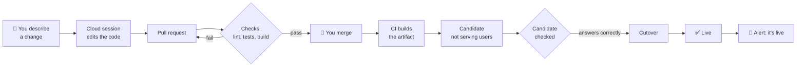
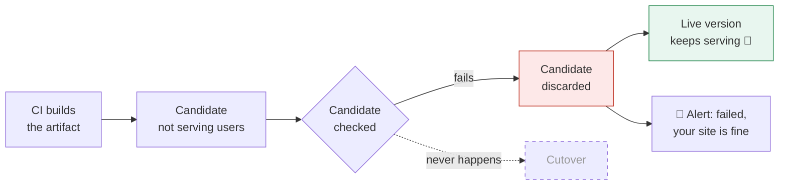
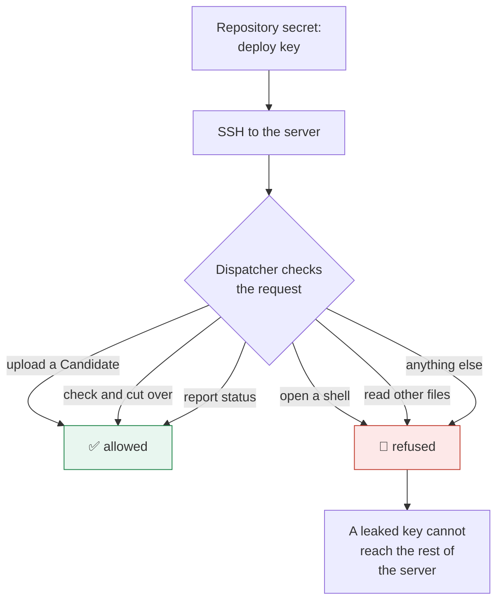

# Mobile Delivery

Design, build, test and deploy real applications from your phone.

> **This is v1.** It describes a workflow that has been built and deployed for real, but not yet proven across many changes. Expect rough edges, and check the Limits section before relying on it.

## What this is

You open an AI coding session from your phone and describe a change. The session works on your GitHub repository and opens a pull request. Checks run. You read the result and merge, from the same phone. The change then deploys itself, and your phone tells you whether it worked.

No laptop is involved at any point. It suits solo developers and small teams who already understand branches, pull requests and CI, and who want to keep shipping while away from a desk.

## Before you start

- A GitHub account and a repository.
- Somewhere to deploy: a small server, a static host, or an app store.
- An AI coding tool that can run a session against a GitHub repo **on its own servers**, started from a phone. That last part matters: a tool that drives your laptop remotely will stop working the moment your laptop sleeps.
- A chat app that can receive messages from a bot, for alerts.

## The words used here

A few terms are used precisely throughout.

| Term | Meaning |
|---|---|
| **Cloud session** | An AI coding session running on the provider's servers against one repository, started from your phone. |
| **Onboarded repo** | A repository deliberately opted into this workflow. |
| **Target** | A buildable part of a repo, such as a frontend or a backend, with its own test and build commands. |
| **Destination** | Where a Target ships to so people can use it. |
| **Live version** | What users are being served right now. |
| **Candidate** | A new build that has arrived at its Destination but is **not yet serving users**. |
| **Cutover** | The moment users switch from the Live version to a Candidate that has already passed its checks. |
| **Alert** | A message to your phone when a Candidate fails and no Cutover happens. |

## The everyday loop

1. Open a Cloud session on an Onboarded repo and describe the change.
2. The session edits the code and opens a pull request on its own branch.
3. Checks run on that pull request: lint, tests and a build, for each Target.
4. You review and merge from your phone.
5. Merging triggers the deploy for whichever Targets changed.
6. The deploy builds the artifact **on CI, never on your server**, uploads it as a Candidate, checks the Candidate, and only then performs the Cutover.
7. Your phone receives a message: live, or failed.

Step 6 is the part worth understanding. Building on CI rather than on the server means a slow or failing build never touches the machine serving your users. The old way, rebuilding in place on the server, leaves the site missing for as long as the build takes.

**How a Candidate gets checked, before anyone sees it:**

- A **website** Candidate is unpacked next to the Live version and served on a private address only the server itself can reach. The deploy fetches the page and the JavaScript file that page references. Only if both answer correctly are the folders swapped, with two renames, so visitors never see a missing site.
- An **API** Candidate is started in a container beside the live one, on a local-only port, and polled until it answers correctly. Only then does it become Live. The previous build is kept, so a bad release can be undone.

## When a deploy fails

Nothing reaches your users. The Candidate is discarded while it is still off to one side, the Live version keeps serving, and your phone gets a message saying exactly that, with a link to the logs.

This is the difference between "deploy and hope" and a gate: a failed deploy becomes a notification rather than an outage. You can fix it when you're back at a computer, and nothing is on fire meanwhile.

## Onboarding a repository

Repositories join **one at a time**, when you start working on one. Onboarding 20 dormant repos up front is how this kind of project dies.

Onboarding is itself done from your phone: open a Cloud session on the repo and point it at your onboarding document. It reads the instructions, looks at the repo, and opens a pull request adding:

- **Access** for the AI tool to that repository.
- **Repo settings** so a session starts with the skills and conventions you use.
- **A short note** in the repo's instructions file, explaining how this repo deploys.
- **Small workflow files** that call your shared checks and deploys, so a fix to how deploys work lands everywhere at once.
- **Secrets**: the deploy key, the server address, and your chat bot's details.

You read the pull request on your phone and merge it. The repo is now Onboarded.

## How it stays safe

Every Onboarded repo holds a deploy key. Keys in repository secrets do leak: through a compromised dependency, a careless log, a stolen laptop. So the key is made almost worthless on its own.

On the server, that key is **locked to a single dispatcher**. Whatever the caller asks for arrives as plain text and is checked against a short list of allowed actions, for apps named in a registry. Anything else is refused, including opening a shell.

Three more things are worth doing on the server itself: keep your apps' own ports off the public internet and put a web server in front to handle certificates; turn off SSH password logins so only keys work; and give each container a memory limit, so one app can't starve the others.

## What still needs you

- **Merging.** That tap is the deliberate safety check, and the only thing standing between an AI's idea and your users.
- **Anything needing a login the automation doesn't have**, such as uploading a mobile app to a store.
- **Diagnosing a failed deploy**, when the cause is the server rather than the code.

## Limits

- **This is v1**, written from a working build but not yet proven over many changes.
- **A successful API deploy still has a gap of a few seconds** while the proven build replaces the running one. A failed deploy never reaches users; a successful one isn't yet seamless.
- **Enforced branch protection** may need a paid plan for private repositories. Without it, merging only after checks pass is a habit rather than a rule.
- **Preview links**, for seeing a change rendered before you merge, aren't part of this yet. You review a description and a diff.
- **Each new kind of Destination** needs its own action added to the dispatcher before a repo using it can be onboarded.

## The checklist

1. Open a Cloud session on the repo, from your phone.
2. Describe the change in one or two clear sentences.
3. Wait for the pull request, then read the diff.
4. Wait for the checks to go green.
5. Merge.
6. Wait for the message on your phone.
7. If it says failed: your site is fine. Open the link, and fix it when you can.
